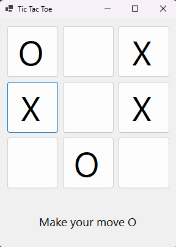
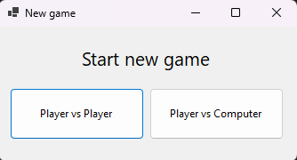
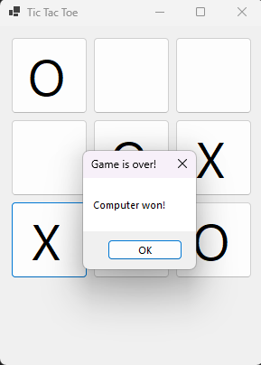

# TicTacToe_C_Sharp

### This is classic Tic Tac Toe game created in C# using Windows Forms.

There are two game modes:
- Player vs Player
- Player vs Computer

When the game ends (win or draw), next game is started immediately after closing pop-up. This mechanism allows you to quickly play multiple games.

### When playing PvE, computer will focus on blocking player. When there is no block opportunity, it will randomly choose empty field.

